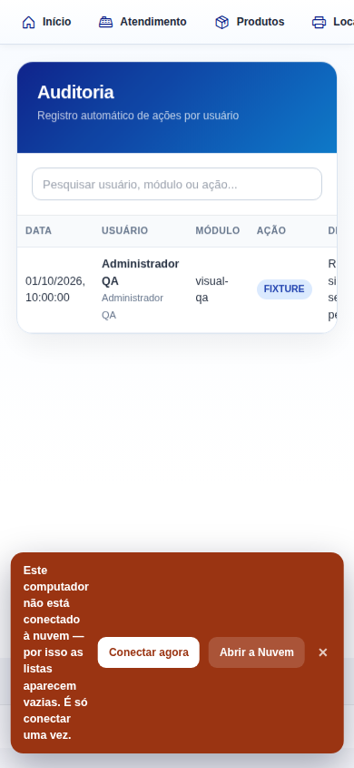

# Relatório de auditoria visual — conteúdo cortado ou encoberto

- **Produto:** Digicopy ERP, checkout local v7.3.11
- **Data:** 1º de outubro de 2026
- **Escopo desta rodada:** identificar elementos que existem ou aparecem na interface, mas não ficam integralmente visíveis no viewport. **Não** foram testadas regras de negócio, gravação, sincronização ou funcionamento da nuvem. **Nenhuma alteração de código foi feita nesta rodada.**

## Resumo executivo

Foram revisados **14 telas/fluxos**, cada um com uma captura desktop (1365×850) e uma mobile (390×844), num total de 28 capturas. Os cortes confirmados estão concentrados no mobile:

1. **Overflow/corte horizontal de tabelas e ações** em Clientes, Impressoras, Contratos, Leituras, Chamados, Financeiro e Auditoria. Há cabeçalhos ou rótulos interrompidos na borda do viewport; em alguns casos as colunas à direita não aparecem na imagem.
2. **Navegação superior cortada à direita:** o rótulo “Locação” aparece repetidamente como “Loca…”/“Loc...” no mobile. A captura não prova se há rolagem horizontal disponível, então não se afirma que o item seja inacessível — apenas que o texto fica cortado no viewport observado.
3. **Janela móvel de Chamados mais larga que a área útil:** a tabela é interrompida no meio de “Equip...” e o botão azul “Novo chamado (fora de contrato)” aparece cortado no lado esquerdo.
4. **Aviso local fixo sobre conteúdo:** nas capturas móveis de alguns módulos, a faixa marrom/alaranjada ocupa a parte inferior da tela e cobre pixels de tabelas ou formulários. O texto do aviso quebra em uma coluna estreita. Isso é registrado **somente como sobreposição visual**; não se avaliou nem se confirmou estado de conexão.
5. **Baixa prioridade:** no estado vazio de Clientes, a mensagem da tabela termina visualmente em “A lista na” junto à borda, e continua na linha seguinte com “por padrão para ficar leve.”

Nas áreas desktop analisadas, títulos, controles e conteúdo principal geralmente cabem no viewport. Dois screenshots desktop mostram um pequeno fragmento de item de navegação na extrema direita, mas não há texto legível para identificar ou confirmar esse item; não foi contado como achado confirmado.

## Achados confirmados

### V-01 — Tabelas e ações móveis não cabem integralmente na largura mostrada

**Prioridade visual: alta** — campos/colunas importantes não ficam todos visíveis simultaneamente; imagens estáticas não permitem determinar se existe rolagem horizontal.

Evidências mais claras:

- **Clientes:** cabeçalho “CPF/CNPJ” aparece truncado como “CPF/CNP...”; cabeçalhos posteriores como Cidade/Ações não aparecem no trecho móvel. A lista está vazia, então não há linhas de clientes para avaliar. [Captura de Clientes — mobile](evidence-visual-r67/final/clientes-mobile.png)
- **Impressoras:** a tabela chega a mostrar até “Contador PB”; o restante da tabela à direita não cabe na captura. [Captura de Impressoras — mobile](evidence-visual-r67/final/impressoras-mobile.png)
- **Contratos:** no viewport mobile a tabela mostra Código, Cliente, Início e Fim; as colunas à direita não aparecem. A captura também mostra controles parcialmente fora da largura. [Captura de Contratos — mobile](evidence-visual-r67/final/contratos-mobile.png)
- **Leituras:** na janela aberta pelo fluxo **Contrato → Leituras**, o cabeçalho termina em “Exced. T...” na borda direita; Total/Status não aparecem completos. A ação “Excluir”, à esquerda do rodapé, fica majoritariamente fora da imagem. [Captura de Leituras — mobile](evidence-visual-r67/final/leituras-contract-mobile.png)
- **Chamados:** a tabela é cortada durante o cabeçalho “Equip...”; a mensagem de estado vazio também termina na borda. O botão azul do rodapé aparece parcialmente fora da borda esquerda, mostrando só o final do rótulo. [Captura de Chamados — mobile](evidence-visual-r67/final/manutencao-mobile.png)
- **Financeiro:** aparece somente o início “V...” do cabeçalho da coluna Valor no limite direito; a faixa local também encobre visualmente a região das linhas. [Captura de Financeiro — mobile](evidence-visual-r67/final/financeiro-mobile.png)
- **Auditoria:** o cabeçalho “DETALHES” aparece apenas como “D...” e o texto da célula é interrompido na borda direita. [Captura de Auditoria — mobile](evidence-visual-r67/final/auditoria-mobile.png)

**Nota de interpretação:** quando uma coluna inteira não aparece, as capturas não distinguem entre coluna responsivamente ocultada e conteúdo fora da largura. O relatório descreve o que o usuário consegue ver na imagem, sem afirmar que a rolagem não existe ou que o conteúdo seja inacessível.

### V-02 — Item “Locação” cortado na navegação superior mobile

**Prioridade visual: média.** O mesmo padrão aparece em várias telas: depois de “Produtos”, a borda direita corta o item selecionado/iniciado como “Loca…” ou “Loc...”. A barra não mostra, nas capturas, uma indicação clara de que possa ser arrastada horizontalmente. Não se conclui que a opção seja inacessível; conclui-se somente que o rótulo está truncado no viewport de 390 px.

Evidência representativa: [navegação no mobile — Produtos](evidence-visual-r67/final/produtos-mobile.png). O mesmo corte é visível em Clientes, Impressoras, Contratos, Vendas, Financeiro, Relatórios, Configurações, Usuários e Auditoria.

### V-03 — Janela de Chamados corta tabela e botão no mobile

**Prioridade visual: alta.** Além do padrão de largura das tabelas, a janela de Chamados ocupa quase toda a largura e seus elementos internos ultrapassam as bordas: o cabeçalho da tabela termina em “Equip...” e o botão azul “Novo chamado (fora de contrato)” fica parcialmente para fora pelo lado esquerdo. [Evidência — janela de Chamados mobile](evidence-visual-r67/final/manutencao-mobile.png)

Na captura desktop (1365×850), filtros, cabeçalhos, mensagem vazia e botões aparecem inteiros. A tabela está em estado vazio; portanto, não há linhas de chamados para inspecionar.

### V-04 — Aviso local fixo encobre parte de conteúdo mobile

**Prioridade visual: média.** A faixa marrom/alaranjada que aparece na sessão local cobre parte da tabela em Impressoras/Contratos/Financeiro e parte do formulário em Configurações; em Vendas ocupa grande parte da região inferior. O próprio texto quebra linha por linha, ficando numa coluna estreita. Exemplos: [Impressoras](evidence-visual-r67/final/impressoras-mobile.png), [Contratos](evidence-visual-r67/final/contratos-mobile.png) e [Configurações](evidence-visual-r67/final/config-mobile.png).

Esta constatação se limita à **posição e área ocupada pelo aviso nas imagens**. Não foi acionado nenhum controle do aviso, nem avaliada a conexão com a nuvem, o estado real do serviço ou a sincronização.

### V-05 — Mensagem de estado vazio de Clientes parece truncada

**Prioridade visual: baixa.** Na captura mobile vazia, o texto termina na borda após “A lista na”; a linha seguinte começa com “por padrão para ficar leve.” A frase não fica integralmente legível na imagem. Como a lista não contém registros exibidos, este achado não se estende a dados de clientes. [Captura de Clientes — mobile](evidence-visual-r67/final/clientes-mobile.png)

## Cobertura por tela

| Tela/fluxo | Desktop | Mobile | Limite observado |
|---|---|---|---|
| Início/Painel | Sem corte confirmado no que aparece | Navegação “Locação” cortada | Área principal ficou vazia; não foi possível avaliar o conteúdo do painel |
| Clientes | Cabeçalhos visíveis | Navegação e cabeçalho da tabela cortados; estado vazio truncado | Sem linhas de clientes na captura |
| Produtos/Estoque | Sem corte confirmado | Navegação cortada | A mensagem “Nenhum produto encontrado” aparece; não há linha para auditar |
| Impressoras | Conteúdo principal visível | Navegação/tabela cortadas; faixa local cobre a parte inferior | Linhas inferiores encobertas pela faixa |
| Locação/Contratos | Tabela e controles visíveis | Navegação/controles/tabela cortados; faixa cobre parte da linha | Não se inferiu comportamento de rolagem |
| Máquinas nos clientes | Não auditável como módulo-alvo | Não auditável como módulo-alvo | A rota mostrou “Impressoras” e “Tela sem conteúdo”, não a tela Máquinas nos clientes |
| Contrato → Leituras | Histórico visível dentro da janela | Colunas à direita e ação esquerda do rodapé cortadas | Fluxo aberto pelo contrato; sem avaliação das regras da leitura |
| Atendimento/Chamados | Janela cabe no viewport | Tabela e botão azul cortados horizontalmente | Janela sobrepõe o fundo; estado vazio, sem registros |
| Vendas/Notinhas | Linha visível sem corte confirmado | Navegação cortada; aviso ocupa região inferior | A tabela não está inteiramente no trecho móvel visível |
| Financeiro | Linhas e colunas visíveis | Cabeçalho da coluna Valor cortado; aviso cobre linhas | Conteúdo sob o aviso não é auditável |
| Relatórios | Cartões e texto visíveis | Navegação cortada; aviso encobre borda inferior de cartão | Valores dos cartões continuam visíveis |
| Configurações | Campos visíveis dentro do viewport | Navegação cortada; aviso cobre continuação do formulário | O restante da página também segue abaixo da dobra |
| Usuários e permissões | Tabela/ações visíveis | Módulo visível; navegação cortada | Aviso não cobre a tabela nesta captura |
| Auditoria | Tabela completa | Navegação e coluna Detalhes cortadas | Uma linha sintética visível |

## Método e isolamento

- 28 screenshots PNG, sem anotação ou edição: 14 pares desktop/mobile. Dimensões: **1365×850** e **390×844**.
- A sessão foi servida de um checkout local e usou somente usuário e registros sintéticos. A fixture foi aplicada em memória para visualização; não foi chamada função de gravação e nenhuma ação de salvar, excluir, faturar ou editar foi executada.
- O Playwright permitiu somente `localhost`; requests para qualquer outro origin foram abortadas antes do envio. Nos dois runs relevantes, foram registrados 17 pedidos GET tentados pelo cliente e interceptados/abortados localmente. Nenhum chegou ao serviço remoto e não foi usado token ou credencial real.
- As capturas de Leituras foram feitas pelo caminho de interface **Contrato → Leituras**; a rota antiga de lançamento direto não foi usada.
- Telas vazias, overlays, conteúdo abaixo da dobra e módulos que não carregaram foram tratados como limitações de cobertura, não como prova automática de truncamento.
- As capturas dos passes iniciais que continham overlays herdados e impediam identificar a tela foram excluídas do pacote final.
- O trabalho desta rodada produziu apenas relatório e evidências visuais. Alterações já existentes no checkout pertencem a trabalho anterior; não foram modificadas nesta auditoria.

## Artefatos

- Pacote com as 28 capturas originais, metadados e leia-me de isolamento: [EVIDENCIA_AUDITORIA_VISUAL_R67.zip](../audit-deliverables/EVIDENCIA_AUDITORIA_VISUAL_R67.zip)
- A conclusão desta rodada é diagnóstica: **nenhuma correção foi implementada**, conforme o escopo solicitado.
